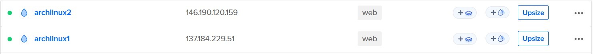
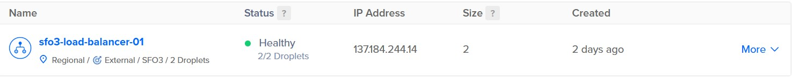
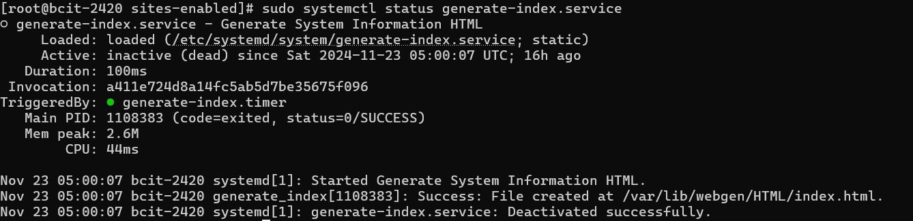
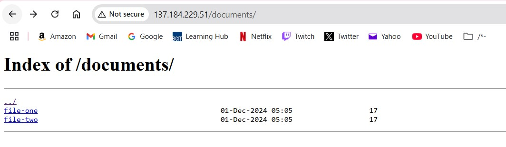
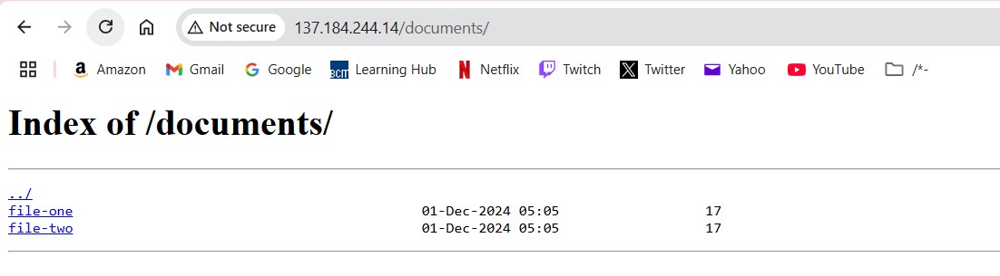
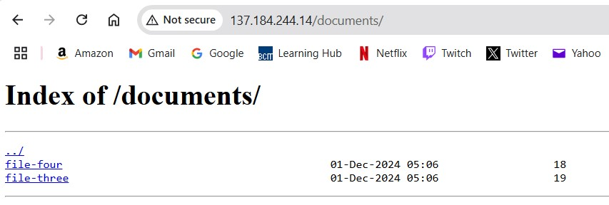

# Linux Assignment3_2

## Setup Digitalocean

Step 1: Make two droplets with the tag web


Step 2: Make a public load balancer including all droplets that are tagged "web":


## Setup droplets using part 1 steps

Task 1: Create System User `webgen`  
1. **Steps** : 
  - Create the system user with home directory and non-login shell:

```bash
sudo useradd -r -m -d /var/lib/webgen -s /usr/sbin/nologin webgen
```
 
  - Ensure the bin and HTML directory structure exists:

```bash
sudo mkdir -p /var/lib/webgen/bin /var/lib/webgen/HTML
```
 
  - Create the `generate_index` script in `/var/lib/webgen/bin/`:

```bash
sudo touch /var/lib/webgen/bin/generate_index /var/lib/webgen/HTML/index.html
```
 
  - Set ownership of both files to the webgen user of the webgen group:

```bash
sudo chown -R webgen:webgen /var/lib/webgen
```

---

Task 2: Configure `generate-index.service` and `generate-index.timer` 
1. **Service File (`nvim /etc/systemd/system/generate-index.service`)** :

```ini
[Unit]
Description=Generate system information HTML
After=network-online.target
Wants=network-online.target

[Service]
User=webgen
Group=webgen
ExecStart=/var/lib/webgen/bin/generate_index

[Install]
WantedBy=multi-user.target
```
 
2. **Timer File (`nvim /etc/systemd/system/generate-index.timer`)** :

```ini
[Unit]
Description=Run generate-index.service daily at 05:00

[Timer]
OnCalendar=*-*-* 05:00:00
Persistent=true

[Install]
WantedBy=timers.target
```
3. **Commands to Enable and Verify** : 
 - Reload systemd daemon to recognize new files
```bash
sudo systemctl daemon-reload
```
  - Enable and start the timer:
  
```bash
sudo systemctl enable generate-index.timer
sudo systemctl start generate_index.timer
```
 
  - Verify timer status:

```bash
sudo systemctl status generate-index.timer
```
 
  - Check logs for service execution:

```bash
sudo journalctl -u generate-index.service
```

---

**Task 3: Configure nginx**  
1. **Update Main `nvim nginx.conf`** : 
  - Edit `/etc/nginx/nginx.conf`:
  - Change the top #user ____
```nginx
#user webgen;
```
2. **Create new directories** :

```bash
mkdir /etc/nginx/sites-available
mkdir /etc/nginx/sites-enabled
```

3. **Updated Server Block File (`nvim /etc/nginx/sites-available/webgen`)** :

```ini
server {
    listen 80;
    listen [::]:80;

    server_name _;

    root /var/lib/webgen/HTML;
    index index.html;

    location / {
        try_files $uri $uri/ =404;
    }
    # new block for the documents in part 2
    location /documents/ {
	root /var/lib/webgen;
	autoindex on;
    }
}
```
4. **Enable the Server Block with symlink** :

```bash
sudo ln -s /etc/nginx/sites-available/webgen /etc/nginx/sites-enabled/webgen
```
 
5. **Restart nginx** :

```bash
sudo systemctl restart nginx
sudo systemctl status nginx
```
6. **Ensure permissions**
```bash
sudo chown -R webgen:webgen /var/lib/webgen
sudo chmod -R 755 /var/lib/webgen
```
## Part2 Setup on both servers after you have done the previous on both

1. **Create the new directory**
```bash
sudo mkdir -p /var/lib/webgen/documents
```

2. **Create the new files**
```bash
echo "This is file one" | sudo tee /var/lib/webgen/documents/file-one
echo "This is file two" | sudo tee /var/lib/webgen/documents/file-two
```

3. **Set correct ownership**
```bash
sudo chown -R webgen:webgen /var/lib/webgen
```

4. **Clone updated `generate_index` file and run it**
```bash
sudo ./generate_index
```

5. **Restart nginx**
```bash
sudo systemctl restart nginx
```

6. **Verify**
- Access <droplet1_ipaddress>/documents/ in 


## Connect with load balancer
- Repeat these steps for the second droplet and then connect to the load balancer I have them serving files 1-4 to show the seperation with the load balancer ip of `137.184.244.14/documents/`

- load balancer server 1


- load balancer server 2

